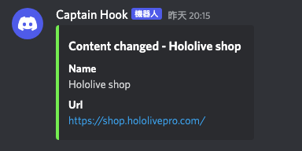

# Content Change Monitor
## Description
A simple html fetcher with cron support to compare html difference and send discord notification if difference found. No database is required.

## Setup
1. Run `npm install` to install required node modules, it is recommended to use version of Node.js >= 14
2. Copy `config.json.sample` to `config.json`
3. Paste your [discord webhook](https://support.discord.com/hc/en-us/articles/228383668-Intro-to-Webhooks) to `discordWebhook` field of the json
4. Update the `websiteName`, `websiteUrl`, `selectorToBeMonitored` and `cronExpression` in the `websites` array
5. Use [pm2](https://www.npmjs.com/package/pm2) to start the app by
```
$ pm2 start index.js
```
6. (Optional) Run `pm2 save` (and `pm2 startup` for auto start pm2 after reboot)

## Discord Notification
A screenshot of notification.

